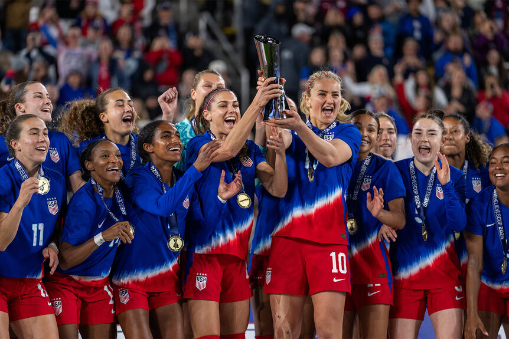

# HW 1 - CS 625, Spring 2025

Nicholas Darrow  
Due: January 26, 2025

## Git, GitHub

*What is the URL of the GitHub repo that you created in your personal account?*
https://github.com/weebitjolly/CS625-Classwork-and-Assignments/tree/main
   
*What is pull vs clone in GitHub?*
Git clone copies all files to the local machine, while git pull only copies the modified files to the local machine.
   
*You have committed a change on your local machine/remote. However, you want to undo the changes committed. How would you do that?* 
https://stackoverflow.com/questions/4114095/how-do-i-revert-a-git-repository-to-a-previous-commit
there's multiple ways to revert a committed change on git, but there are two ways that stand out to me as being the most useful. One is a hard delete on unpublished commits and the other is reverting old commits with new ones. supposedly deleteing entire branches isn't useful so instead of delete whole files we just replace the old commits with new changes.

## Markdown

*Create a bulleted list with at least 3 items*
### Here is a bulleted list with at least 3 items. I'm planning on going to the Grocery Store
- 2 dozen eggs
- Sweet Potatoes
- Blueberries

*Write a single paragraph that demonstrates the use of italics, bold, bold italics, code, and includes a link. The paragraph must explain your favorite Olympic sport/game, the country that won the most number of olympic GOLD medals (Summer) in your favorite sport in 2020 (Japan) and 2024 (France). You are free to include more information.*

My favorite olympic sport is **Women's Soccer**. ***Women's Soccer*** is *hosted* during every Summer Olympics. It has the same rules as normal soccer, but it is played by women from around the world. I mostly like this sport because the United States wins gold in the sport a lot. In **2020** and **2024** the United States won the most gold medals in the sport. if you'd like to learn more visit [US Women's Soccer](https://www.ussoccer.com/teams/uswnt).

### Here is some code: 
to view pull up a csv in jupyter notebook type 'pd.read_csv(path_to_csv)'

*Create a level 3 heading*
### Level 3 heading

*Insert a image of your favorite Olympics sport/game, sized appropriately*

## Tableau

*Insert the image of your horizontal bar chart here. Reminder, this should show countries that won the least number of medals only (excluding ZERO) in Paris2024 Summer Olynpics by continent (one country from each continent is ok).*

![alt text]

## Google Colab

*What is the URL of your Google Colab notebook?*

## Python/Seaborn

*Insert the first penguin chart here*

*Describe what the figure is showing.*

*Insert the second penguin chart here*

*Describe what the figure is showing.*

*What happened when you removed the outer parentheses from the code? Why?*

## Observable and Vega-Lite

*What happens when you replace `markCircle()` with `markSquare()`?*

*What happens when you replace `markCircle()` with `markPoint()`?*

*What change do you need to make to swap the x and y axes on the scatterplot?*

*Insert the bar chart image here*

*Why do you think this chart is the result of this code change?*

## References

*Every report must list the references (including the URL) that you consulted while completing the assignment. Replace the items below with the references you consulted*

* Reference 1, <https://www.example.com>
* Reference 2, <https://www.example.com/reallyreallyreally-extra-long-URI/>
