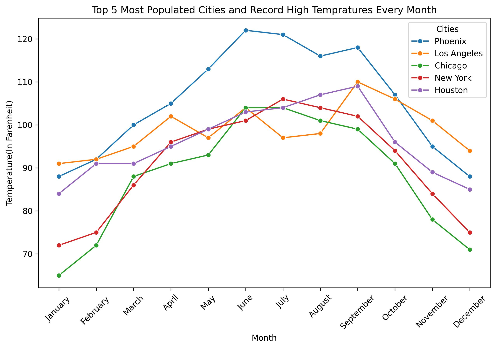
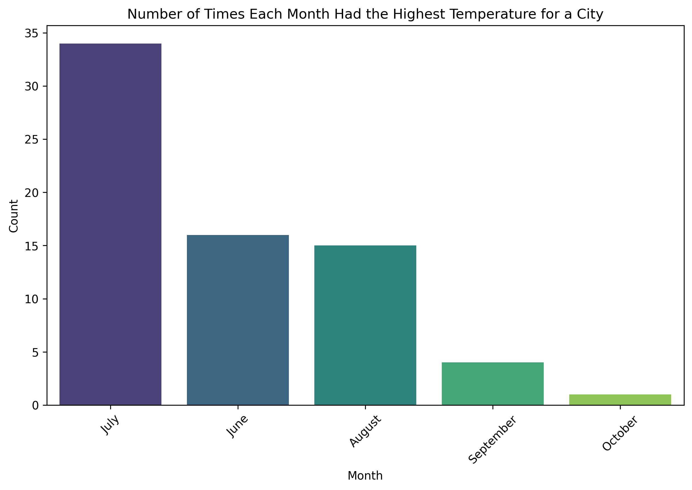

## Name: Nick Darrow
## UIN: 01178936
## Class: CS625
## Assignment HW4
## Date: 03/19/25

##Dataset 3: Record High Temperatures
### Q1: *Record High Temperatures for the top 5 Most Populated Cities*

- Link to the chart(s): https://colab.research.google.com/drive/1XOmwWl5qf14c1EUq-FLcZVEbUjp9Ae6d?usp=sharing

-idiom chart
| Data: Attribute  | Data: Attribute Type  | Encode: Channel |  
|-----------------|----------------------|----------------|  
| Month          | key, ordered          | outer horizontal spatial region (x-axis) |  
| Temperature    | value, quantitative   | vertical position on a common scale (y-axis) |  
| Station       | categorical           | color hue (hue) |  
| Station       | categorical           | line identity (each line represents a station) |  
| Data Points   | individual values     | marker shape (optional, for emphasis) |

*generated with the help of AI* 

This idiom is appropriate for the chart and question because it shows both how different categories (cities) differ and compare with one another, but also how they change over time. I tried to do this with a clustered bar chart but this did not effectively do the second task, this is why the multiple line chart appropriately showed the 5 cities I chose and their correspionding temperatures.

Insights: 
we can see that in the above chart both regional implications and a general pattern that temperatures follow by month. First we can see that both chicago and New York follow a similar path, with a steady rise in fall in high temperatures over the year. In Los Angeles we can see more varied drops and increases throuhgout the year. with Phoenix having the clear highest temperatures throuhgout the year. More insights could be garnered with a mirrored chart that maps record lows.

Design Choices:
Other than the base seaborn designs, there is no extraneous additions in terms of changing marks, outside of using hue to differentiate categories, but other than that there was no thought put into design choices. if I were to change something it would be to change some data labels to remove the y-axis which takes up a lot of space.

### Q2 *Months with the Highest Temps

-idiom chart:

| **Data: Attribute** | **Data: Attribute Type** | **Encode: Channel** |  
|---------------------|-------------------------|----------------------|  
| Month              | key, ordered             | outer horizontal spatial region (x-axis) |  
| Count              | value, quantitative      | vertical position on a common scale (y-axis) |  
| Month              | categorical              | color hue (hue, via `palette='viridis'`) |  
| Data Points        | individual values        | bar height (each bar represents a month’s count) |  

*again created with the help of AI*

This idiom is appropriate for the question because it effectively shows the number of times a month has had the highest temperature for each of the stations. it uses the viridis pallete to indicate intensity/level of that bar, and has count on the y-axis to show the number of times that month has been the highest temperature for all the cities.

Insights:
from what we can see on the chart July has the highest count of high temperatures out of any month with June and August following behind at a large margin. with September and October being left in the dust. Its clear that July is the hottest month in most of the US.

Design Choices:
Here the hardest part was just aggregating and grouping data by highest month totals in the code. as for design choices viridis seemed to be the best choice to indicate levels of counts.

## Further Questions

It would be interesting to see how different cities vary in terms of temperature overtime, what would enhance this is variables to correlate with to see what different factors influence temperatures across the United States possibly even levels of CO2 emissions by state.

## References
this was generated using chat GPT as a baseline which I adapted for my first chart

plt.figure(figsize=(10, 6))

sns.lineplot(data=df, x='Date', y='Value', hue='Category', marker='o')

plt.title("Multiple Line Chart using Seaborn")

plt.xlabel("Date")

plt.ylabel("Value")

plt.xticks(rotation=45)

plt.legend(title="Category")

plt.show()

