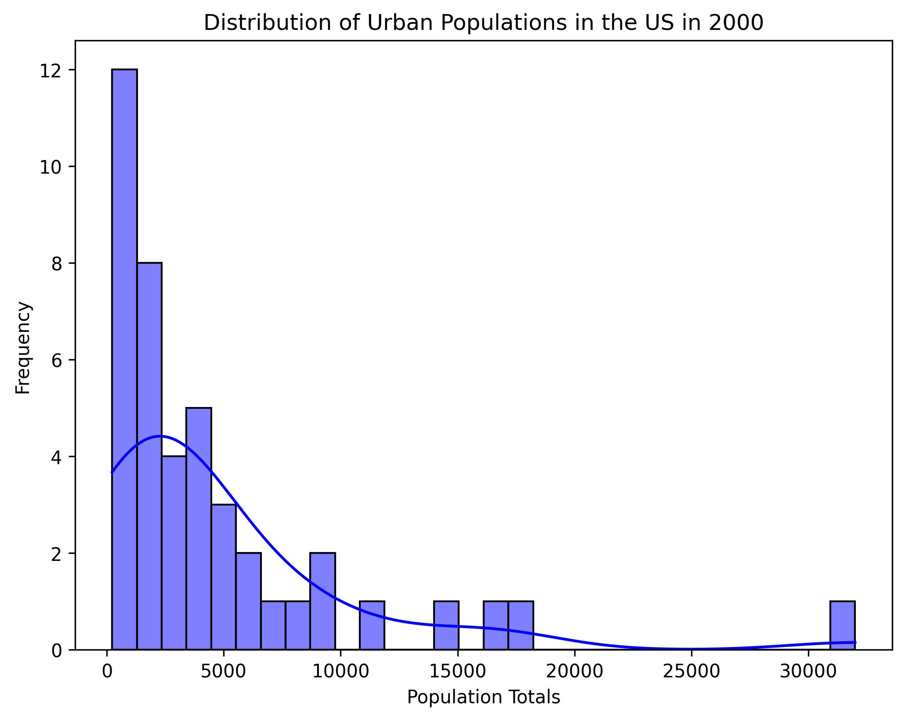
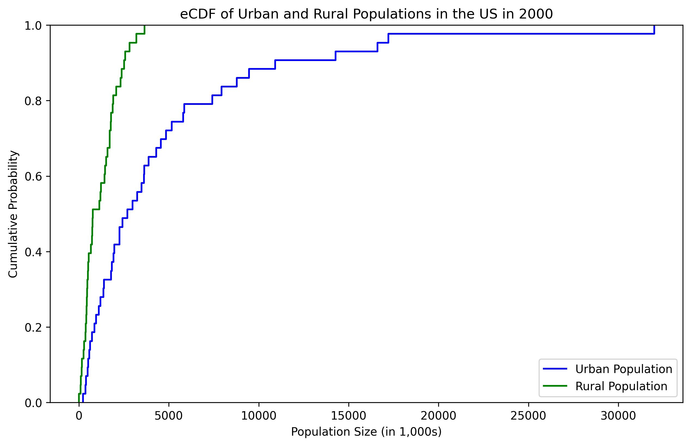

## Name: Nick Darrow
## UIN: 01178936
## Class: CS625
## Assignment HW5
## Date: 03/24/25

link to the google colab where these visual were created: https://colab.research.google.com/drive/1wQig4G7FziJlTVUBhTbv3dRKzgAribFG#scrollTo=kUgTb-Ox_D4Q 

# Part 1: Chart Creation and Intial Analysis

## Chart 1:boxplot: Show the distributions of the urban and rural populations in 2000

### Data Manipulation
intially I didn't have to do much data manipulation on python until the later parts of this assignment, but originally I used power query editor to make my manipulations, please refence the link above to see the DAX for that. I had move some values around, rename some columns and replace some values, I really don't know how they use this format its inaccessible for data scientists.


### Explanation of Advantages, Disadvantages and Observations

```sns.boxplot(x='Population Type', y='Total', data=URP) 
#plt.yscale('log')
plt.savefig('boxplotsURP.jpg', dpi=300, bbox_inches='tight')
plt.show() 


## Chart 2: histogram: Show the distribution of either the urban or rural population in 2000 (your chart title must indicate which)

### Data Manipulation



### Explanation of Advantages, Disadvantages and Observations

## Chart 3: eCDF: Show the distributions of urban and rural populations in 2000

### Data Manipulation



### Explanation of Advantages, Disadvantages and Observations

# Part 2: Further Analysis

## References
