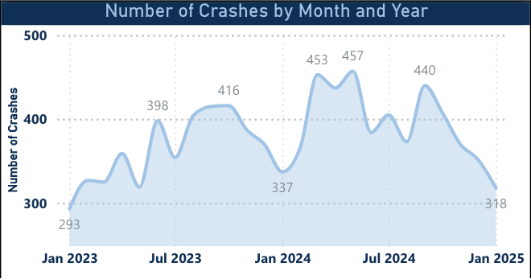
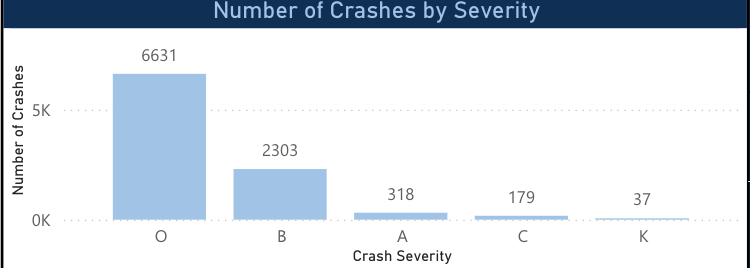
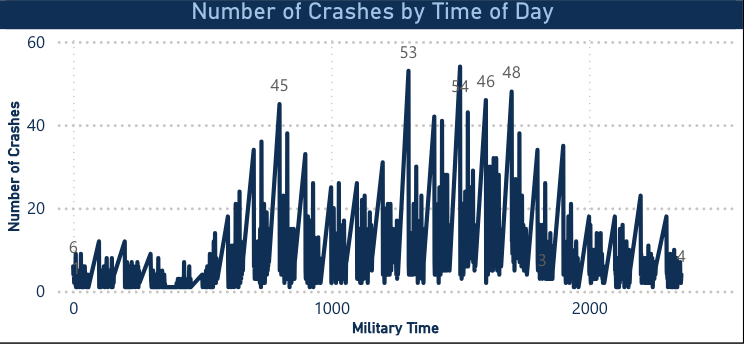
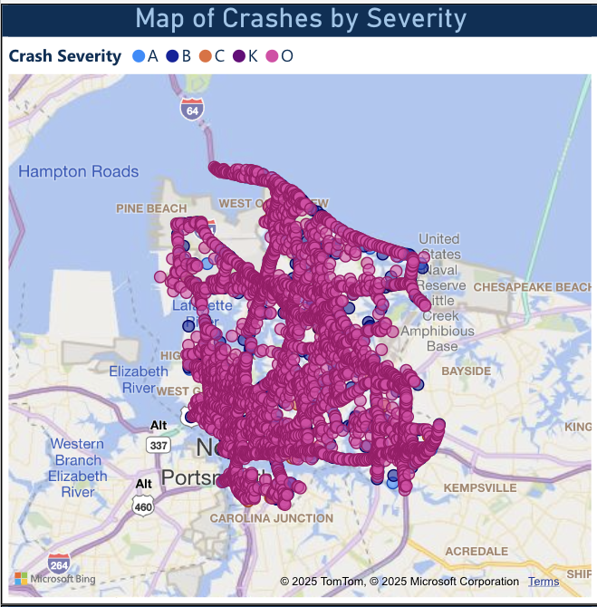
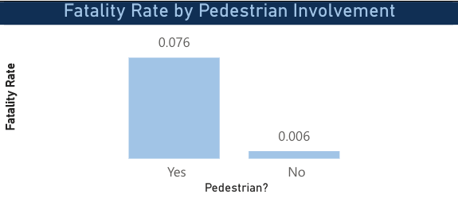

## Name: Nick Darrow
## UIN: 01178936
## Class: CS625
## Semester Project
## Date: 04/20/25

### Dataset
the dataset I chose for this project is a dataset sourced from VDOT containing datapoints from 2023-2025 about vehicle accidents in the state of Virginia. 
it was orginally dating back to 2016, but I decided against it because I wanted a smaller sample size. it contains info about time, location and context surrounding 
accidents all throughout Virginia, and focused most of my analysis on Norfolk.

### Final Questions addressed:
-Where do most accidents happen?
-what are the details of crashes?
-When do accidents happen?
-What causes fatal accidents?

### Final Charts

| Data: Attribute     | Data: Attribute Type | Encode: Channel                                              |
|---------------------|----------------------|--------------------------------------------------------------|
| Date (Month & Year) | key, ordered         | horizontal position (x-axis)                                 |
| Number of Crashes   | value, quantitative  | vertical position (y-axis)                                   |
| Crash Count         | quantitative         | line height (area filled below)                              |
| Crash Count         | quantitative         | data point label (text above peaks and troughs)              |
| Date                | temporal             | line continuity (smooth curve across time)                   |
| Number of Crashes   | quantitative         | vertical area fill color (solid blue, low opacity)           |

### Explanation:
This chart answers the question of when these crashes happen showing peaks and valleys of the prevalence of crashes over months and years. The name is
appropriate because its not too long and not misleading either.

| Data: Attribute   | Data: Attribute Type  | Encode: Channel                                  |
|-------------------|-----------------------|--------------------------------------------------|
| Crash Severity     | categorical (ordinal) | horizontal position (x-axis)                     |
| Number of Crashes  | quantitative          | vertical position (bar height on y-axis)         |
| Crash Count        | quantitative          | bar size (height encodes number of crashes)      |
| Crash Count        | quantitative          | label text (number displayed above each bar)     |
| Crash Severity     | categorical           | bar identity (each bar represents a severity)    |

### Explanation:
this answers the question of the detail of crashes. it tells use the prevalence of different levels of severity of crashes. We can also enhance this visual with filters
and slicers to provide more info. The title is appropriate because it says exactly whats in the graph and it is not misleading.

| Data: Attribute   | Data: Attribute Type | Encode: Channel                                  |
|-------------------|----------------------|--------------------------------------------------|
| Time of Day       | ordered (temporal)   | horizontal position (x-axis, in military time)   |
| Number of Crashes | quantitative         | vertical position (y-axis)                       |
| Crash Count       | quantitative         | bar height (each vertical line represents count) |
| Crash Count       | quantitative         | label text (optional: peaks are annotated)       |

### Explanation:
This is another answer to the when question but more granular. It tells the user what times of day we can expect more crashes, in this case during rush hours. Title is appropriate because it works to differentiate itself from the monthly counts visual.

| Data: Attribute    | Data: Attribute Type | Encode: Channel                                     |
|--------------------|----------------------|-----------------------------------------------------|
| Crash Location     | geographic (spatial) | latitude & longitude coordinates (map position)     |
| Crash Severity     | categorical (ordinal) | color hue (legend mapped to A, B, C, K, O)          |
| Crash              | individual instance  | point marker (circle plotted on map)                |

### Explanation:
this answers the where question. Highly dynamic with the use filters, this visual give a geospatial distribution of crashes in an area. the title is appropriate because it says exactly whats in the visual without being midleading.

 

| Data: Attribute   | Data: Attribute Type | Encode: Channel                                     |
|-------------------|----------------------|-----------------------------------------------------|
| Pedestrian?       | categorical (binary) | horizontal position (x-axis)                        |
| Fatality Rate     | quantitative         | vertical position on common scale (y-axis)          |
| Pedestrian?       | categorical (binary) | bar identity (each bar represents Yes or No)        |
| Fatality Rate     | quantitative         | label text (numeric value shown above each bar)     |
| Pedestrian?       | categorical (binary) | bar fill color (same hue, no variation here)        |

### Explanation:
This answers the question "What causes fatal accidents?". at first it may be confusing, but this confusion is soon cleared up when you look closer at each chart. 
we can see the fatality rate of different factors being involved in accidents and tells us what cause fatal accidents more then others by comparing factors together.
The titles are different for each small multiple, and although they are simple visuals (bar chart), we can garner many insights through comparison of factors

Link to charts: https://github.com/weebitjolly/CS625-Classwork-and-Assignments/blob/main/Car%20and%20Bike%20Dashboard.pbix

## Final Thought
This project gave me a chance to explore crash patterns across the Commonwealth in a way that genuinely reshaped how I think about traffic safety. Building the dashboard helped me better understand not just where crashes are happening, but also what factors are associated with the most severe outcomes.

One of the biggest challenges I faced was working with small multiples. I initially set out to run logistic regressions by transforming the “Yes”/“No” categorical columns (like alcohol, speeding, etc.) into binary (1/0) variables. But after digging in, I found that Power BI doesn’t handle logistic regression particularly well—at least not natively. So I pivoted. Instead, I used small multiple bar charts to visualize fatality rates by factor, which ended up being a clean and powerful way to tell the story using visuals that Power BI supports well.

Surprisingly, the part that took the most time and iteration wasn’t the visuals or formatting—it was figuring out which questions I could meaningfully answer with the available data. At one point, I planned to incorporate daily vehicle and bike counts generated using computer vision models I had trained. But I ran into a roadblock: there was no shared column to join the traffic volume dataset to the crash data, so I chose to focus entirely on the crash records.

In the end, I think it turned out well. The process helped sharpen both my data storytelling and my technical decision-making. There’s still a lot I want to build on here, and I’m excited to continue developing this project further.

## References
I utilized chatgpt for some of the data transformation and story boarding, it was helpful in outlining the project better for me.

https://www.ibm.com/think/topics/logistic-regression

https://medium.com/qash/predictive-analytics-using-logistic-regression-in-power-bi-2c695c9345cc

used this for more ideas:
https://dashboard.virginiadot.org/pages/safety/crashes.aspx

