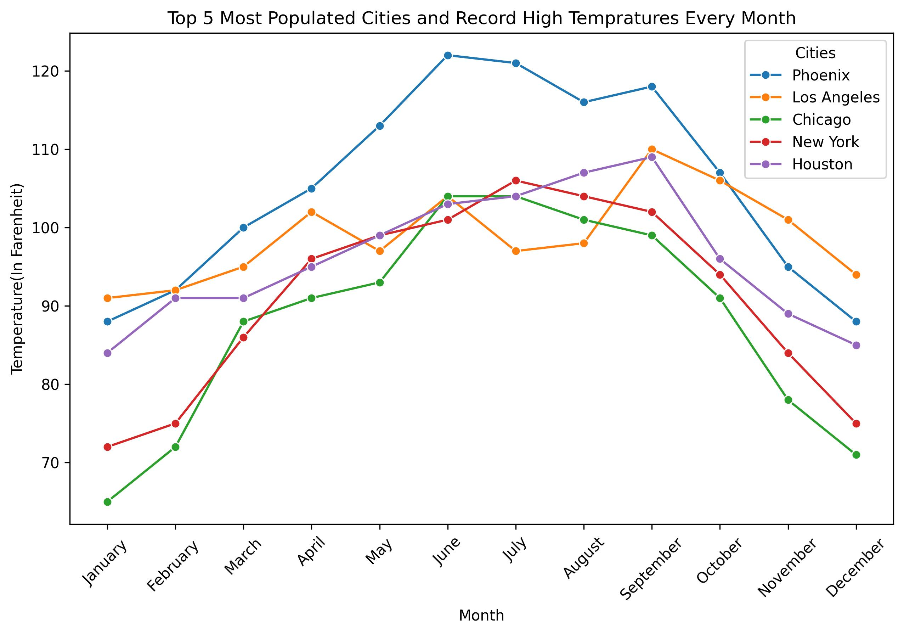

## Name: Nick Darrow
## UIN: 01178936
## Class: CS625
## Semester Project
## Date: 04/20/25

### Dataset
the dataset I chose for this project is a dataset sourced from VDOT containing datapoints from 2023-2025 about vehicle accidents in the state of Virginia. 
it was orginally dating back to 2016, but I decided against it because I wanted a smaller sample size. it contains info about time, location and context surrounding 
accidents all throughout Virginia, and focused most of my analysis on Norfolk.

###Final Questions addressed:
-Where do most accidents happen?
-When do accidents happen?
-What causes fatal accidents?

###Final Charts

